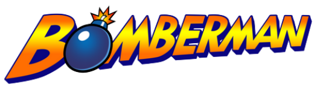
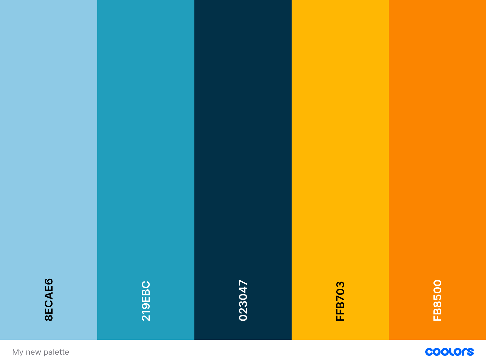
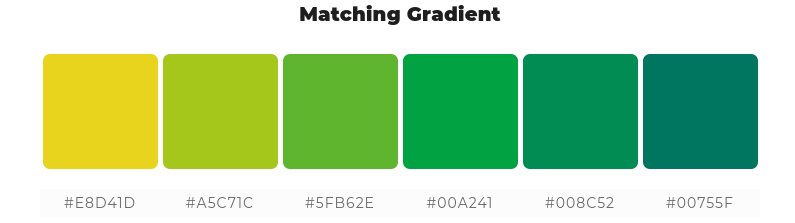

# Indie Studio Epitech

**Indie Studio** is a remake of the **Bomberman** game. The goal of the game is to kill the opponents by droppping bombs. You can pick up power-ups to upgrade either the number of bomb you can drop, your bomb ray range or your moving speed. It's possible to play locally with 3 other players or against IA if you are not 4 players.
<br>
<br>


<br>
<br>

-----------
<br>

## How to clone the **repository**
<br>

```
git clone git@github.com:EpitechIT2020/B-YEP-400-TLS-4-1-indiestudio-thomas.marches.git
```
<br>

## How to compile **Indie Studio** ##
<br>

```
mkdir build
cd build/
cmake ..
cmake --build .
cd ..
```
<br>


## How to launch the **Game**
<br>

```
./bomberman
```
<br>

## How to launch the **Unit Tests**
<br>

```
./run_test.sh
```
<br>

## How to create **Coverage**
<br>

```
./create_coverage.sh
```

<br>

-----------
<br>

## Commit norm

Angular commit norm :

The type informs us of the type of commit. 9 types are available :

* `build` : changes that affect the build system or external dependencies (npm, make ...)
* `ci` : changes concerning integration or configuration files and scripts (Travis, Ansible, BrowserStack…).

* `feat` : addition of a new feature.

* `fix` : bug fixed.

* `perf` : performance improvement.

* `refactor` : modification that does not bring new functionality or performance improvement.

* `style` : change which does not bring any functional or semantic alteration (indentation, formatting, addition of space, renaming of a variable, etc.).

* `docs` : writing or updating documentation.

* `test` : addition or modification of tests.
<br>
<br>

-----------
<br>

## Libraries
<br>

**Graphical library**

* https://www.raylib.com/

<br>

**Physical library**

* https://www.reactphysics3d.com/
<br>
<br>

-----------
<br>

## Graphical charts
<br>


<br>
<br>

<br>
<br>

For the game we have :

* `Rocks` : who represents the indestructible walls.
* `Metal boxes` : who represents the limit of the map.
* `Wood boxes` : who represents the destructible walls and could contain power-ups.
* `Grass ground` : to make the environment more alive.
<br>
<br>

-----------
<br>

## Repository

* https://github.com/ThomasMarches/Indie-Studio
<br>
<br>

-----------
<br>

## Credits

* **Jad Chahed** _alias_ [@Jad31](https://github.com/Jad31)
* **Samuel Besseau** _alias_ [@smbss1](https://github.com/smbss1)
* **Lexia Ledaga** _alias_ [@Laeksya](https://github.com/Laeksya)
* **Grégoire Marty** _alias_ [@Shadisun](https://github.com/Shadisun)
* **Thomas Marches** _alias_ [@ThomasMarches](https://github.com/ThomasMarches)
* **Rémi Henry** _alias_ [@RemiHenry](https://github.com/RemiHenry)
